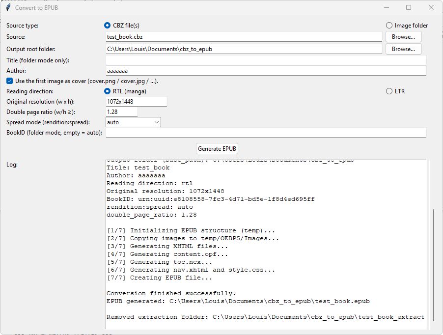

# Panel2EPUB

Panel2EPUB is a small toolkit and desktop application to convert **image folders** or **CBZ files** into **fixed-layout EPUB** books, with specific support for comics and manga:

- automatic **double-page detection and splitting**

- configurable **reading direction** (RTL / LTR)

- smart **cover handling** (`cover.*` file or first image)

- EPUB 3–compatible structure (OPF, TOC, NAV, CSS)

It is designed to generate clean EPUBs that work well on typical e-readers and tablet reading apps.


[Buy me a coffee](#buy-me-a-coffee)

---

## Preview



---

## Features

- **Two input modes**
  
  - Image folder mode
  
  - One or multiple CBZ files (batch conversion)

- **Cover handling**
  
  - If a file named `cover.*` (e.g. `cover.jpg`, `cover.png`) exists, it is used as cover.
  
  - Otherwise, the **first image** is used as cover.

- **Double-page support**
  
  - Detects potential double-page spreads based on a **width/height ratio threshold**.
  
  - Splits double pages vertically into left/right halves.
  
  - Supports both **LTR** and **RTL** mapping:
    
    - LTR: `_a` = left half, `_b` = right half
    
    - RTL: `_a` = right half, `_b` = left half
  
  - Optionally inserts **blank pages** to align spreads correctly (`page-spread-left` / `page-spread-right`).

- **Reading direction**
  
  - `RTL` for manga-style reading.
  
  - `LTR` for western comics or standard books.
  
  - Encoded properly in the EPUB spine (`page-progression-direction`).

- **Fixed-layout EPUB**
  
  - Pre-paginated pages with image-based layout.
  
  - Per-page viewport equal to the image size (or half-size for double-page splits).
  
  - Simple CSS for fullscreen display without borders.

- **Batch processing for CBZ**
  
  - Multiple CBZ files can be selected at once.
  
  - Each CBZ is extracted, converted, and its extraction folder is removed afterwards.
  
  - All resulting EPUB files are written in the chosen output root folder.

- **Temporary folder cleanup**
  
  - A `temp/` working folder is created under the output root.
  
  - Once the EPUB is created, `temp/` is removed automatically.

---

## Requirements

### Runtime

- **Python** 3.9+ (tested with CPython 3.x)

- A desktop OS supported by:
  
  - Tkinter (for the GUI)
  
  - Pillow (for image manipulation)

The code only uses the Python standard library plus **Pillow** and **Pillow’s Image module**, which handles image loading, sizing and cropping.

### Python packages

Content of `requirements.txt` could be:

```text
Pillow>=10.0.0
```

All other imports are from the standard library:

- `os`, `shutil`, `datetime`, `uuid`, `zipfile`

- `xml.sax.saxutils.escape`, `html.escape`

- `threading`, `traceback`

- `tkinter` / `tkinter.ttk` / `tkinter.filedialog` / `tkinter.messagebox`

> Note: Tkinter is bundled with the official Python installers on Windows and most Linux distributions. On some minimal Linux setups, you may need to install it via your package manager (for example `python3-tk` on Debian/Ubuntu).

---

## Compatibility / tested readers

Generated EPUBs are, in principle, EPUB 3 fixed-layout compatible.  
However, they have **only been tested manually** with:

- **Thorium Reader** (desktop – Windows/macOS/Linux) ([GitHub](https://github.com/edrlab/thorium-reader?utm_source=chatgpt.com "edrlab/thorium-reader: A cross platform desktop reading ..."))
  
  - Open-source EPUB 3 reader focused on accessibility and good support for reflowable and fixed-layout EPUB.
  
  - GitHub: `https://github.com/edrlab/thorium-reader`

- **Apple Books** on iOS / iPadOS ([Apple](https://www.apple.com/apple-books/?utm_source=chatgpt.com "Apple Books"))
  
  - Built-in Apple e-book app on iPhone/iPad, supporting EPUB (including fixed layout) and PDF.

Other reading apps and devices may:

- ignore some `rendition:` metadata,

- handle spreads differently,

- or have varying support for fixed-layout EPUB 3.

If you rely on a specific device or app, you should test a few sample books.

---

## Project structure 

```text
panel2epub/
├─ convert_to_epub.py        # Core logic: EPUB structure / splitting / OPF / TOC
├─ panel2epub_gui.py         # Tkinter GUI (EpubApp)
├─ README.md
├─ requirements.txt
├─ test_book.cbz             # Example of input CBZ (optional)
└─ test_book/                # Example input images (optional)
```

In the codebase described:

- `convert_to_epub.py` contains:
  
  - `initial_setup`
  
  - `copy_images_to_temp_images`
  
  - `generate_xhtml_pages`
  
  - `generate_content_opf`
  
  - `generate_toc_ncx`
  
  - `generate_nav_xhtml`
  
  - `generate_style_css`
  
  - `create_epub_from_temp`

- The GUI file (e.g. `panel2epub_gui.py`) contains:
  
  - `run_pipeline_folder`
  
  - `run_pipeline_cbz_list`
  
  - `EpubApp` (Tkinter GUI, entry point under `if __name__ == "__main__": ...`)

---

## Installation

1. **Clone the repository**

```bash
git clone https://github.com/<your-username>/Panel2EPUB.git
cd Panel2EPUB
```

2. **Create and activate a virtual environment** (optional but recommended)

**On Windows:**

```bash
python -m venv .venv
.venv\Scripts\activate
```

**On macOS / Linux:**

```bash
python3 -m venv .venv
source .venv/bin/activate
```

3. **Install dependencies**

```bash
pip install -r requirements.txt
```

or simply:

```bash
pip install Pillow
```

if you are not using a `requirements.txt` file.

---

## Running the GUI

Assuming your GUI script is named `panel2epub_gui.py`:

```bash
python panel2epub_gui.py
```

A window titled **“Convert to EPUB”** should open.

---

## GUI usage

### 1. Source type

At the top of the window:

- **CBZ file(s)**  
  Batch conversion of one or more `.cbz` files.

- **Image folder**  
  Conversion of a single folder containing image files.

### 2. Source

- Click **“Browse…”** next to **Source**:
  
  - In **folder mode**: select the folder containing your images.
  
  - In **CBZ mode**: select one or more `.cbz` files.

The selected path(s) are displayed in the text field.

### 3. Output root folder

- Click **“Browse…”** next to **Output root folder**.

- Choose where:
  
  - the temporary `temp/` working directory will be created, and
  
  - the resulting EPUB file(s) will be saved.

By default, this is your current working directory.

### 4. Title (folder mode only)

- Only used when **Source type = Image folder**.

- This becomes the EPUB title and the base for the output filename.

In **CBZ mode**, each EPUB title is derived from the CBZ filename.

### 5. Author

- Enter the **Author** (creator) of the book.

- This field is required in both modes.

### 6. Cover handling

Checkbox text:

> **Use the first image as cover, or a file named cover.png / cover.jpg / ... if present.**

Behaviour:

- If checked:
  
  - If a file named `cover.*` exists in the image set, it is used as the cover image.
  
  - Otherwise, the **first image** is used as cover.

- If unchecked:
  
  - No special cover metadata is added (the first page is treated like any other).

### 7. Reading direction

- **RTL (manga)**: right-to-left reading order.

- **LTR**: left-to-right reading order.

This affects:

- the spine `page-progression-direction`, and

- how `_a` / `_b` halves of double pages are mapped to left/right.

### 8. Original resolution

Field: **Original resolution (w x h)**  
Example: `1072x1448`

- Used in metadata and as a fallback size when an image’s dimensions cannot be read.

- Format: `widthxheight`.

### 9. Double page ratio

Field: **Double page ratio (w/h ≥)**  
Example: `1.28`

- If `image_width / image_height >= double_page_ratio`, the image is treated as a **double-page spread**.

- Double pages are split vertically into two halves and handled as a spread.

- If parsing fails, a default value of `1.3` is used.

### 10. Spread mode (`rendition:spread`)

Field: **Spread mode (rendition:spread)**

Options:

- `auto`

- `none`

- `landscape`

- `both`

This value is written to:

```xml
<meta property="rendition:spread">...</meta>
```

in `content.opf`, which may influence how certain reading apps display spreads.

### 11. BookID (folder mode only)

Field: **BookID (folder mode, empty = auto)**

- If provided, it is used as the EPUB’s unique identifier (`dc:identifier`).

- If left empty, a value like `urn:uuid:<random-uuid>` is generated automatically.

- In **CBZ mode**, a new BookID is always generated for each CBZ file and this field is ignored.

### 12. Generate EPUB

- Click **“Generate EPUB”** to start conversion.

- The button is disabled while the process runs in a background thread.

- Log messages appear in the **Log** area at the bottom.

At the end:

- On success, a message box shows the path(s) of the generated EPUB file(s).

- On failure, an error message is shown and the full traceback is printed in the log area.

---

## Command-line / programmatic usage

You can also use the core functions in `convert_to_epub.py` directly from your own scripts.

### Example: convert a folder programmatically

```python
from convert_to_epub import (
    initial_setup,
    copy_images_to_temp_images,
    generate_xhtml_pages,
    generate_content_opf,
    generate_toc_ncx,
    generate_nav_xhtml,
    generate_style_css,
    create_epub_from_temp,
)
import uuid
import os

base_path = os.getcwd()
source_images = "./my_images"
title = "My Comic"
creator = "Author Name"
reading_direction = "rtl"
original_resolution = "1072x1448"
book_id = f"urn:uuid:{uuid.uuid4()}"
spread_mode = "auto"
double_page_ratio = 1.3

# 1) Prepare temp structure
initial_setup(base_path=base_path)

# 2) Copy images
copy_images_to_temp_images(source_folder=source_images, base_path=base_path)

# 3) Generate XHTML pages with double-page detection
fallback_w, fallback_h = 1072, 1448
generate_xhtml_pages(
    base_path=base_path,
    fallback_width=fallback_w,
    fallback_height=fallback_h,
    reading_direction=reading_direction,
    double_page_ratio=double_page_ratio,
)

# 4) Generate OPF, TOC, NAV, CSS
generate_content_opf(
    base_path=base_path,
    title=title,
    creator=creator,
    has_cover=True,
    reading_direction=reading_direction,
    original_resolution=original_resolution,
    book_id=book_id,
    spread_mode=spread_mode,
)
generate_toc_ncx(base_path=base_path, book_id=book_id, title=title)
generate_nav_xhtml(base_path=base_path, title=title)
generate_style_css(base_path=base_path)

# 5) Create EPUB (temp folder is removed automatically)
epub_path = create_epub_from_temp(base_path=base_path, title=title)
print("EPUB generated:", epub_path)
```

---

## How double-page splitting works

1. **Detection**
   
   For each raster image (JPEG/PNG/WebP/etc.):
   
   ```python
   ratio = width / height
   ```
   
   - If `ratio >= double_page_ratio` → treated as a **double-page spread**.
   
   - Otherwise → treated as a **single page**.

2. **Splitting**
   
   For double-page images:
   
   - The image is split vertically into two halves (left / right).
   
   - Two new files are created with `_a` and `_b` suffixes.
   
   - The original file is removed from the images folder.

3. **Mapping (RTL / LTR)**
   
   - **LTR mode**:
     
     - `_a` = left half, `_b` = right half.
   
   - **RTL mode**:
     
     - `_a` = right half, `_b` = left half.

4. **Spine alignment**
   
   - The system ensures that the first half of the spread appears on the correct side  
     (left or right), depending on the reading direction.
   
   - If needed, a **blank page** is inserted before the spread to fix alignment.

---

## Limitations and notes

- The project targets **fixed-layout, image-based EPUBs** for comics/manga.  
  It is not meant for reflowable text EPUBs.

- Behaviour of spreads and `rendition:spread` metadata can vary between reading systems.

- Tested only with:
  
  - Thorium Reader (desktop). ([edrlab.org](https://www.edrlab.org/software/thorium-reader/?utm_source=chatgpt.com "Thorium Reader"))
  
  - Apple Books on iOS / iPadOS. ([Apple](https://www.apple.com/apple-books/?utm_source=chatgpt.com "Apple Books"))

- SVG images are currently skipped by the XHTML generator (they can be added later if needed).

---

## Roadmap / ideas

- Per-book configuration profiles.

- Pure CLI mode (no GUI) for batch pipelines.

- More advanced TOC generation (chapters, volumes, arcs).

- Better SVG handling.

- Reader/device-specific presets (Kindle, Kobo, etc.).

---

## License

This project is released under [The Unlicense](./LICENSE).


In short: it is public-domain style software – you can copy, modify, redistribute, and use it for any purpose, with no warranty of any kind.

---

## Acknowledgements

- Python standard library (zipfile, tkinter, etc.)

- [Pillow](https://python-pillow.org/) for image processing

- [Thorium Reader](https://github.com/edrlab/thorium-reader) for being a solid EPUB 3 test reader ([GitHub](https://github.com/edrlab/thorium-reader?utm_source=chatgpt.com "edrlab/thorium-reader: A cross platform desktop reading ..."))

- Apple Books as a convenient EPUB reader on iOS / iPadOS ([Apple](https://www.apple.com/apple-books/?utm_source=chatgpt.com "Apple Books"))

## Buy me a coffee

If this project is useful to you and you would like to support it, you can send crypto donations to:

**Ethereum address**  
`0xcB27fF7e2A1B0e9BD0CCeDf76Bf0F90ebF4F7b85`

**Solana (SOL) address**  
`2H38wLmz6RbV7Z9sXnMURxAggST9kSQvRFXZqkppzAFb`

Thank you for your support 🙌
